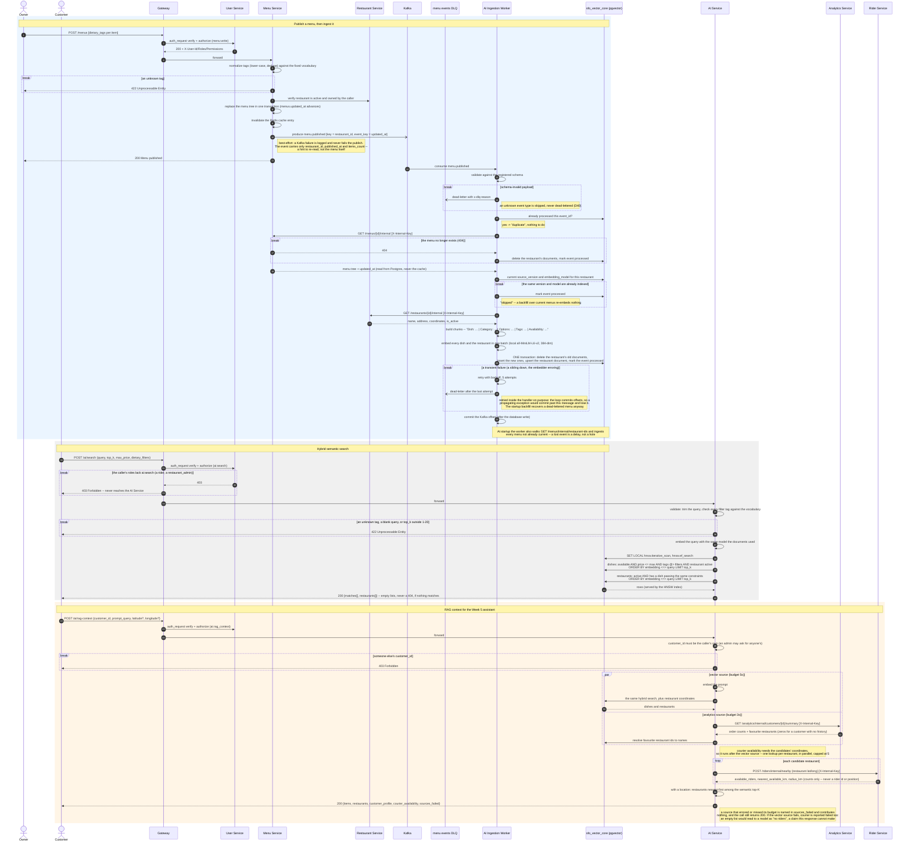

# SmartFoodOps — AI Retrieval Sequence Diagram

From an owner publishing a tagged menu, through its ingestion into the vector store, to a customer
searching it and asking for RAG context. Verified against
`services/menu/apis/menus.py`, `services/common/kafka.py`, `services/common/events/menu.py`,
`services/ai/ingestion.py`, `services/ai/chunking.py`, `services/ai/embeddings.py`,
`services/ai/repositories/{vectors,documents}.py`, `services/ai/apis/{search,rag}.py`,
`services/ai/rag_context.py`, `services/rider/apis/dispatch.py` and
`services/analytics/apis/internal.py`. The reasoning is in
[D59–D62](../key-decisions.md) and the phased build in
[week4-ai-retrieval-plan.md](../week4-ai-retrieval-plan.md).

The gateway's `auth_request` verify round trip (D51/D57) is drawn once, at the first gateway-fronted
call of each section; every `Gateway->>...: forward` runs the same check. Calls marked `[X-Internal-Key]`
use the shared service-to-service key (D15): the ingestion worker and the RAG assembler hold no user
token, and none of those routes has a `route_permissions` row, so the gateway refuses them even for an
admin's bearer.

