# SmartFoodOps — Entity Relationship Diagram

Reflects the actual schema across all 7 physical databases (`db/*/init.sql`) as of Week 3 —
see [readme/key-decisions.md](../key-decisions.md) for the D-numbers cited inline below.

```mermaid
erDiagram
    %% ---- sfo_user_core ----
    ROLES }o--o{ USERS : "grants_role_to (via USER_ROLES)"

    %% ---- cross-database references, verified over HTTP, no engine FK ----
    USERS ||--o{ RESTAURANTS : "onboards / owns"
    USERS ||--o| RIDERS : "acts_as (zero-or-one)"
    USERS ||--o{ ORDERS : "places"
    RESTAURANTS ||--o{ ORDERS : "fulfills"
    RESTAURANTS ||--o| MENUS : "defines (cross-db, zero-or-one)"
    RIDERS ||--o{ ORDERS : "delivers"
    ORDERS ||--o| PAYMENTS : "has_payment (cross-db, zero-or-one)"

    %% ---- same-database, real foreign key ----
    ORDERS ||--o{ ORDER_TRACKING_LOGS : "traces (real FK, ON DELETE CASCADE)"

    %% ---- Week 3: transactional outbox (same-db writes, no FK) ----
    ORDERS ||--o{ ORDER_OUTBOX : "emits (same-db, order_outbox.aggregate_id)"
    ORDERS ||--o{ PAYMENT_OUTBOX : "emits payment events (cross-db aggregate_id = order_id, by design)"

    %% ---- Week 3: Kafka is the only thing connecting these -- no SQL relation exists ----
    ORDER_OUTBOX ||--o{ PROCESSED_EVENTS : "deduped by consumer (via Kafka, logical)"
    PAYMENT_OUTBOX ||--o{ PROCESSED_EVENTS : "deduped by consumer (via Kafka, logical)"
    ORDERS ||--o| ORDER_PROJECTIONS : "projected (via Kafka, logical, cross-db)"

    ROLES {
        int id PK
        varchar name "Unique, seeded: customer/restaurant_admin/rider/system_admin"
        text description
        timestamp created_at
    }

    USERS {
        uuid id PK
        varchar email "Unique via case-insensitive index, not a column constraint"
        varchar password_hash
        varchar full_name
        varchar phone "Unique"
        timestamp created_at
        timestamp updated_at
    }

    USER_ROLES {
        uuid user_id FK "References USERS.id, ON DELETE CASCADE"
        int role_id FK "References ROLES.id, ON DELETE RESTRICT"
        timestamp granted_at
    }

    RESTAURANTS {
        uuid id PK
        uuid owner_id "References USERS.id -- cross-db, no engine FK, verified over HTTP"
        varchar name
        text address
        decimal latitude
        decimal longitude
        boolean is_active
        int capacity
        timestamp created_at
        timestamp updated_at
    }

    RIDERS {
        uuid id PK
        uuid user_id "References USERS.id (Unique) -- cross-db, no engine FK"
        varchar vehicle_type
        varchar vehicle_number "Unique"
        boolean is_available
        uuid current_order_id "References ORDERS.id -- cross-db; unique partial index (at most one rider per order)"
        timestamp created_at
        timestamp updated_at
    }
    %% current_latitude/current_longitude moved out of this table in D49 -- live location
    %% is now a Redis GEO index (riders:geo), not a Postgres column. Not representable in
    %% a relational ERD, so it is noted here rather than drawn as a fifth entity.

    MENUS {
        uuid id PK
        uuid restaurant_id "Unique -- References RESTAURANTS.id, cross-db, no engine FK"
        jsonb categories "Whole category/item/customization tree, one row per restaurant"
        timestamp created_at
        timestamp updated_at
    }

    ORDERS {
        uuid id PK
        uuid customer_id "References USERS.id -- cross-db, no engine FK"
        uuid restaurant_id "References RESTAURANTS.id -- cross-db, no engine FK"
        uuid rider_id "Nullable; References RIDERS.id -- cross-db, no engine FK"
        jsonb items "Historical item & pricing snapshot at checkout"
        decimal total_amount
        order_status status "created/confirmed/assigned/picked_up/delivered/cancelled"
        kitchen_decision kitchen_decision "Nullable enum: accepted/rejected (D32)"
        timestamp kitchen_decided_at "Nullable"
        rider_report_stage rider_reported_stage "Nullable enum: picked_up/delivered (D46)"
        timestamp rider_reported_at "Nullable"
        varchar idempotency_key "Unique, nullable -- prevents duplicate order creation"
        timestamp created_at
        timestamp updated_at
    }

    ORDER_TRACKING_LOGS {
        uuid id PK
        uuid order_id FK "References ORDERS.id, real FK, ON DELETE CASCADE (same DB)"
        bigserial seq "Append order; disambiguates entries within one transaction"
        order_status old_status "Nullable; derived server-side from the preceding row"
        order_status new_status
        varchar service "Which microservice observed the transition"
        varchar updated_by "Actor on whose behalf it happened, default 'system'"
        text raw_log "Nullable"
        jsonb metadata "Dynamic per-event fields"
        timestamp created_at
    }

    PAYMENTS {
        uuid id PK
        uuid order_id "Unique -- References ORDERS.id, cross-db, no engine FK"
        varchar idempotency_key "Unique -- prevents double-charging"
        decimal amount
        payment_status status "pending/authorized/captured/refunded"
        varchar transaction_reference "Nullable -- external gateway id"
        timestamp created_at
        timestamp updated_at
    }

    ORDER_OUTBOX {
        uuid id PK "Also the event's dedup key downstream"
        bigserial seq "Claim order for the relay; NOT a resumable high-water cursor"
        varchar aggregate_type "Default 'order'"
        uuid aggregate_id "= orders.id = the Kafka partition key"
        varchar event_type
        smallint event_version
        jsonb payload
        text traceparent "Nullable -- W3C trace context captured at insert time"
        text tracestate "Nullable"
        timestamptz occurred_at
        timestamptz published_at "Nullable -- NULL means unpublished; the relay's only WHERE clause"
        int attempts
        text last_error "Nullable"
    }

    PAYMENT_OUTBOX {
        uuid id PK
        bigserial seq
        varchar aggregate_type "Default 'payment'"
        uuid aggregate_id "= orders.id, NOT payments.id -- deliberate, so payment events share order_outbox's partition key"
        varchar event_type
        smallint event_version
        jsonb payload
        text traceparent "Nullable"
        text tracestate "Nullable"
        timestamptz occurred_at
        timestamptz published_at "Nullable"
        int attempts
        text last_error "Nullable"
    }

    PROCESSED_EVENTS {
        varchar consumer_group PK "Composite PK with event_id"
        uuid event_id PK "= the outbox row's own id, stable across at-least-once redelivery"
        varchar event_type
        timestamptz processed_at
    }

    ORDER_PROJECTIONS {
        uuid order_id PK "Not an FK -- derived from Kafka events, own database"
        uuid restaurant_id "Nullable, denormalized from the event payload"
        uuid customer_id "Nullable, denormalized from the event payload"
        decimal total_amount "Nullable"
        varchar status
        timestamptz placed_at "Nullable"
        timestamptz delivered_at "Nullable"
        timestamptz cancelled_at "Nullable"
        double delivery_seconds "Nullable -- computed from envelope occurred_at, not Kafka transport time"
        timestamptz updated_at
    }
```

