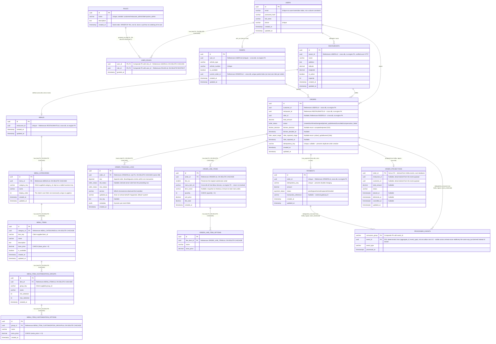

# SmartFoodOps — Entity Relationship Diagram

Reflects the actual schema across all 7 physical databases (`db/*/init.sql`), including D53
(the transactional outbox tables are removed) — see
[readme/key-decisions.md](../key-decisions.md) for the D-numbers cited inline below.

> **`order_outbox`/`payment_outbox` are gone (D53).** Publishing moved to a Temporal
> activity each write chains itself to, with workflow history as the durability ledger
> instead of a `published_at IS NULL` row — see
> [readme/outbox-removal-temporal-design.md](../outbox-removal-temporal-design.md). The
> dedup key `PROCESSED_EVENTS` keys on is no longer an outbox row's own `id`; it is now
> derived deterministically from `(aggregate_id, event_type)`
> (`common.kafka.deterministic_event_id`), which is why that relationship below reads
> straight off `ORDERS`/`PAYMENTS` rather than through an intermediate outbox entity.

```mermaid
erDiagram
    %% ---- sfo_user_core ----
    USERS ||--o{ USER_ROLES : "has (real FK, ON DELETE CASCADE)"
    ROLES ||--o{ USER_ROLES : "granted_via (real FK, ON DELETE RESTRICT)"

    %% ---- cross-database references, verified over HTTP, no engine FK ----
    USERS ||--o{ RESTAURANTS : "onboards / owns"
    USERS ||--o| RIDERS : "acts_as (zero-or-one)"
    USERS ||--o{ ORDERS : "places"
    RESTAURANTS ||--o{ ORDERS : "fulfills"
    RESTAURANTS ||--o| MENUS : "defines (cross-db, zero-or-one)"
    RIDERS ||--o{ ORDERS : "delivers"
    ORDERS ||--o| PAYMENTS : "has_payment (cross-db, zero-or-one)"

    %% ---- same-database, real foreign key ----
    ORDERS ||--o{ ORDER_TRACKING_LOGS : "traces (real FK, ON DELETE CASCADE)"

    %% ---- Week 3: normalized out of a single JSONB column each in D50 ----
    MENUS ||--o{ MENU_CATEGORIES : "has (real FK, ON DELETE CASCADE)"
    MENU_CATEGORIES ||--o{ MENU_ITEMS : "has (real FK, ON DELETE CASCADE)"
    MENU_ITEMS ||--o{ MENU_ITEM_CUSTOMIZATION_GROUPS : "has (real FK, ON DELETE CASCADE)"
    MENU_ITEM_CUSTOMIZATION_GROUPS ||--o{ MENU_ITEM_CUSTOMIZATION_OPTIONS : "has (real FK, ON DELETE CASCADE)"
    ORDERS ||--o{ ORDER_LINE_ITEMS : "has (real FK, ON DELETE CASCADE)"
    ORDER_LINE_ITEMS ||--o{ ORDER_LINE_ITEM_OPTIONS : "has (real FK, ON DELETE CASCADE)"

    %% ---- D53: no outbox tables any more -- Kafka is the only thing connecting these,
    %% no SQL relation exists. event_id is derived from (aggregate_id, event_type), not
    %% read from a row, so the logical relation is drawn straight off the aggregate.
    ORDERS ||--o{ PROCESSED_EVENTS : "deduped by consumer (via Kafka, logical, event_id derived)"
    PAYMENTS ||--o{ PROCESSED_EVENTS : "deduped by consumer (via Kafka, logical, event_id derived)"
    ORDERS ||--o| ORDER_PROJECTIONS : "projected (via Kafka, logical, cross-db)"

    ROLES {
        uuid id PK
        varchar name "Unique, seeded: customer/restaurant_admin/rider/system_admin"
        text description
        timestamp created_at "Seed order; ORDER BY this, not id, since a uuid has no ordering of its own"
    }

    USERS {
        uuid id PK
        varchar email "Unique via case-insensitive index, not a column constraint"
        varchar password_hash
        varchar full_name
        varchar phone "Unique"
        timestamp created_at
        timestamp updated_at
    }

    USER_ROLES {
        uuid user_id PK, FK "Composite PK with role_id -- References USERS.id, ON DELETE CASCADE"
        uuid role_id PK, FK "Composite PK with user_id -- References ROLES.id, ON DELETE RESTRICT"
        timestamp granted_at
    }

    RESTAURANTS {
        uuid id PK
        uuid owner_id "References USERS.id -- cross-db, no engine FK, verified over HTTP"
        varchar name
        text address
        decimal latitude
        decimal longitude
        boolean is_active
        int capacity
        timestamp created_at
        timestamp updated_at
    }

    RIDERS {
        uuid id PK
        uuid user_id "References USERS.id (Unique) -- cross-db, no engine FK"
        varchar vehicle_type
        varchar vehicle_number "Unique"
        boolean is_available
        uuid current_order_id "References ORDERS.id -- cross-db; unique partial index (at most one rider per order)"
        timestamp created_at
        timestamp updated_at
    }
    %% current_latitude/current_longitude moved out of this table in D49 -- live location
    %% is now a Redis GEO index (riders:geo), not a Postgres column. Not representable in
    %% a relational ERD, so it is noted here rather than drawn as a fifth entity.

    MENUS {
        uuid id PK
        uuid restaurant_id "Unique -- References RESTAURANTS.id, cross-db, no engine FK"
        timestamp created_at
        timestamp updated_at
    }
    %% categories moved out of this table in D50 -- normalized into the four entities below.

    MENU_CATEGORIES {
        uuid id PK
        uuid menu_id FK "References MENUS.id, ON DELETE CASCADE"
        varchar category_key "Client-supplied category_id, kept as a stable business key"
        varchar name
        int display_order "The client's own field; not necessarily unique or gapless"
        timestamp created_at
        timestamp updated_at
    }

    MENU_ITEMS {
        uuid id PK
        uuid category_id FK "References MENU_CATEGORIES.id, ON DELETE CASCADE"
        varchar item_key "Client-supplied item_id"
        varchar name
        text description
        decimal base_price "CHECK (base_price > 0)"
        boolean is_available
        timestamp created_at
        timestamp updated_at
    }

    MENU_ITEM_CUSTOMIZATION_GROUPS {
        uuid id PK
        uuid item_id FK "References MENU_ITEMS.id, ON DELETE CASCADE"
        varchar group_key "Client-supplied group_id"
        varchar name
        int min_selection
        int max_selection
        timestamp created_at
    }

    MENU_ITEM_CUSTOMIZATION_OPTIONS {
        uuid id PK
        uuid group_id FK "References MENU_ITEM_CUSTOMIZATION_GROUPS.id, ON DELETE CASCADE"
        varchar name
        decimal extra_price "CHECK (extra_price >= 0)"
        timestamp created_at
    }

    ORDERS {
        uuid id PK
        uuid customer_id "References USERS.id -- cross-db, no engine FK"
        uuid restaurant_id "References RESTAURANTS.id -- cross-db, no engine FK"
        uuid rider_id "Nullable; References RIDERS.id -- cross-db, no engine FK"
        decimal total_amount
        order_status status "created/confirmed/assigned/picked_up/delivered/cancelled/compensation_failed"
        kitchen_decision kitchen_decision "Nullable enum: accepted/rejected (D32)"
        timestamp kitchen_decided_at "Nullable"
        rider_report_stage rider_reported_stage "Nullable enum: picked_up/delivered (D46)"
        timestamp rider_reported_at "Nullable"
        varchar idempotency_key "Unique, nullable -- prevents duplicate order creation"
        timestamp created_at
        timestamp updated_at
    }
    %% items moved out of this table in D50 -- normalized into the two entities below.

    ORDER_LINE_ITEMS {
        uuid id PK
        uuid order_id FK "References ORDERS.id, ON DELETE CASCADE"
        smallint line_no "Preserves the original submission order"
        varchar menu_item_id "Cross-db ref into Menu Service, no engine FK -- never re-resolved"
        varchar item_name "Nullable; snapshot at checkout, immune to later menu edits"
        int quantity "CHECK (quantity > 0)"
        decimal unit_price
        decimal line_total
        timestamp created_at
    }

    ORDER_LINE_ITEM_OPTIONS {
        uuid id PK
        uuid line_item_id FK "References ORDER_LINE_ITEMS.id, ON DELETE CASCADE"
        varchar name
        decimal extra_price
    }

    ORDER_TRACKING_LOGS {
        uuid id PK
        uuid order_id FK "References ORDERS.id, real FK, ON DELETE CASCADE (same DB)"
        bigserial seq "Append order; disambiguates entries within one transaction"
        order_status old_status "Nullable; derived server-side from the preceding row"
        order_status new_status
        varchar service "Which microservice observed the transition"
        varchar updated_by "Actor on whose behalf it happened, default 'system'"
        text raw_log "Nullable"
        jsonb metadata "Dynamic per-event fields"
        timestamp created_at
    }

    PAYMENTS {
        uuid id PK
        uuid order_id "Unique -- References ORDERS.id, cross-db, no engine FK"
        varchar idempotency_key "Unique -- prevents double-charging"
        decimal amount
        payment_status status "pending/authorized/captured/refunded"
        varchar transaction_reference "Nullable -- external gateway id"
        timestamp created_at
        timestamp updated_at
    }

    PROCESSED_EVENTS {
        varchar consumer_group PK "Composite PK with event_id"
        uuid event_id PK "D53: deterministic from (aggregate_id, event_type), not an outbox row's id -- stable across at-least-once redelivery the same way, just derived instead of stored"
        varchar event_type
        timestamptz processed_at
    }

    ORDER_PROJECTIONS {
        uuid order_id PK "Not an FK -- derived from Kafka events, own database"
        uuid restaurant_id "Nullable, denormalized from the event payload"
        uuid customer_id "Nullable, denormalized from the event payload"
        decimal total_amount "Nullable"
        varchar status
        timestamptz placed_at "Nullable"
        timestamptz delivered_at "Nullable"
        timestamptz cancelled_at "Nullable"
        timestamptz updated_at
    }
```
