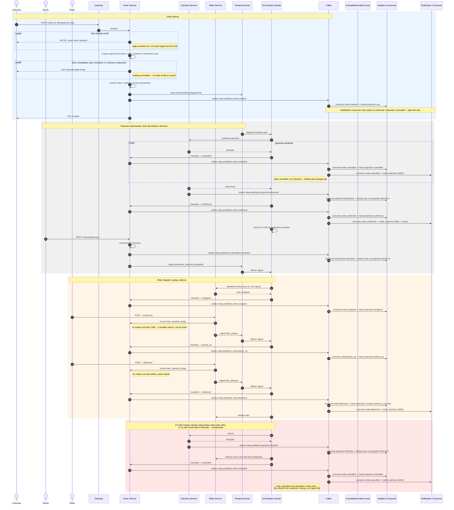

# SmartFoodOps — Order Flow Sequence Diagram

Creation through delivery, the failure/compensation path, and the Kafka eventing that runs
alongside — the one diagram for the order flow. Verified against
`services/order/apis/checkout.py`, `services/orchestrator/workflows/order.py`,
`services/orchestrator/activities/order.py`, `services/order/apis/kitchen.py`,
`services/order/apis/rider_reports.py`, `services/order/apis/transitions.py`,
`services/rider/apis/delivery.py`, and `services/common/outbox.py`. See
[readme/order-saga-orchestration-guide.md](../order-saga-orchestration-guide.md) for the
full reasoning behind each step.

