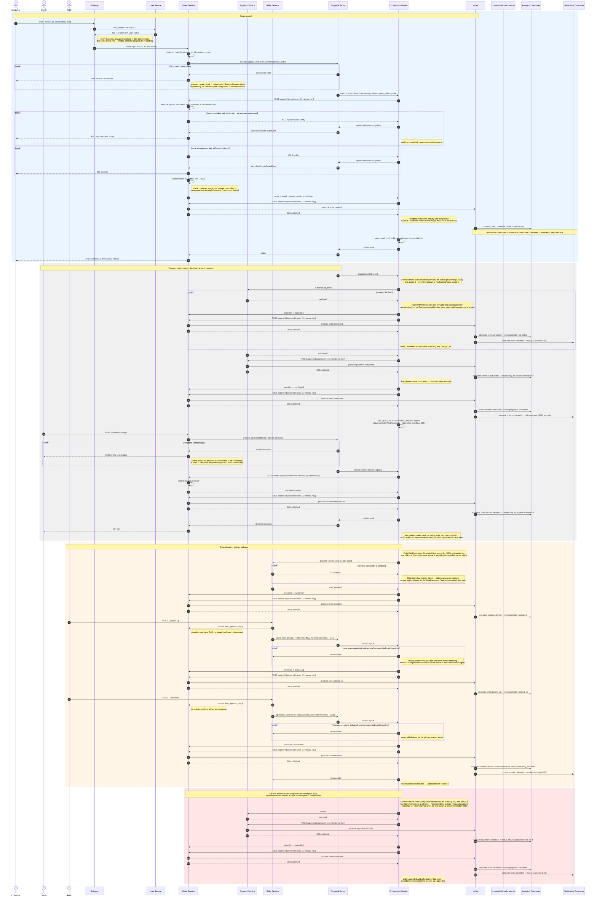

# SmartFoodOps — Order Flow Sequence Diagram

Creation through delivery, the failure/compensation path, and the Kafka eventing that runs
alongside — the one diagram for the order flow. Verified against
`services/order/apis/checkout.py`, `services/order/apis/internal_orders.py`,
`services/order/apis/internal_kitchen.py`, `services/order/apis/internal_events.py`,
`services/orchestrator/workflows/order.py`, `services/orchestrator/workflows/payment.py`,
`services/orchestrator/workflows/rider.py`, `services/orchestrator/workflows/compensation.py`,
`services/orchestrator/activities/order.py`, `services/orchestrator/activities/payment.py`,
`services/orchestrator/activities/rider.py`, `services/order/apis/kitchen.py`,
`services/order/apis/rider_reports.py`, `services/order/apis/transitions.py`,
`services/rider/apis/delivery.py`, `services/rider/fleet.py`, and
`services/common/kafka.py`'s `KafkaGateway`. See
[readme/order-saga-orchestration-guide.md](../order-saga-orchestration-guide.md) for the
full reasoning behind each step.

The gateway's `auth_request` verify round trip (D51) is drawn once below, at the only
gateway-fronted call in this flow — every later `Gateway->>...: forward` in this platform
runs the same check. `RiderSvc->>OrderSvc: record rider_reported_stage` stays on the
internal key (D26), unaffected by D51/D52: a rider reporting a pickup or delivery is a fact
about what it observed, not a call made *as* the customer.

> **"Order placed" below reflects [D54](../key-decisions.md#d54--order-creation-moves-inside-temporal-via-update-with-start), implemented.** See
> [readme/order-creation-temporal-update-design.md](../order-creation-temporal-update-design.md)
> for the full design and the trade-offs it makes. `OrderSvc` no longer inserts the order
> directly and starts the saga as a separate, fire-and-forget step afterward (D25, superseded);
> the insert now happens *inside* the workflow via a Temporal Update, closing that gap at the
> cost of a new hard dependency on Temporal for checkout itself.

> **Every `-)Kafka:` publish below reflects [D53](../key-decisions.md#d53--the-outbox-tables-are-removed-workflow-history-becomes-the-publish-ledger), implemented.**
> See [readme/outbox-removal-temporal-design.md](../outbox-removal-temporal-design.md).
> `order_outbox`/`payment_outbox` and their relays (D39, superseded) are gone: the business
> write and the Kafka publish are two sequential Temporal activities, so Temporal's own
> workflow history — not a database row — is what guarantees the publish is retried until it
> succeeds. The kitchen decision (`POST /orders/{id}/accept|reject`) likewise moves from a
> plain DB write plus a best-effort signal into a Temporal Update, since D53 needs an activity
> to attach the publish to and none existed for that write before.

> **Payment, rider dispatch/delivery, and compensation now run as child workflows, per
> [D55](../key-decisions.md#d55--payment-rider-and-compensation-become-child-workflows-of-orderworkflow), implemented.**
> `OrderWorkflow` starts `PaymentWorkflow`, `RiderWorkflow` and `CompensationWorkflow` as
> children and awaits each — marked with a `Note` at the start of the relevant section below,
> rather than drawn as separate lifelines, since every HTTP call they make still flows through
> the same `Orchestrator Worker` process either way. Two behavioural changes worth noticing
> while reading: `RiderSvc` now signals pickup/delivery **directly into `RiderWorkflow`**
> (`rider-<order_id>`), not into `OrderWorkflow` (`order-<order_id>`) as before; and
> `RiderWorkflow` releases whatever rider it claimed on *every one of its own* exit paths —
> delivered, or a timed-out pickup/delivery with nothing recovered — so `CompensationWorkflow`
> never touches the fleet at all, unlike the single-workflow version this replaces.

```mermaid
sequenceDiagram
    autonumber
    actor Customer
    actor Owner
    actor Rider
    participant Gateway
    participant UserSvc as User Service
    participant OrderSvc as Order Service
    participant PaymentSvc as Payment Service
    participant RiderSvc as Rider Service
    participant Temporal as Temporal Server
    participant Worker as Orchestrator Worker
    participant Kafka
    participant DLQ as Unreadable/invalid events
    participant Analytics as Analytics Consumer
    participant NotifConsumer as Notification Consumer

    rect rgb(235, 245, 255)
        Note over Customer, Kafka: Order placed
        Customer->>Gateway: POST /orders [X-Idempotency-Key]
        Gateway->>UserSvc: auth_request verify (D51)
        UserSvc-->>Gateway: 200 + X-User-Id/X-User-Roles
        Note right of Gateway: every Gateway forward elsewhere in this platform runs<br/>this same check first -- omitted after this diagram for readability
        Gateway->>OrderSvc: forward [X-User-Id, X-User-Roles]
        OrderSvc->>OrderSvc: order_id = uuid5(customer_id, idempotency_key)
        OrderSvc->>Temporal: execute_update_with_start_workflow(create_order)
        break Temporal unreachable
            Temporal-->>OrderSvc: connection error
            OrderSvc-->>Customer: 503 Service Unavailable
            Note right of OrderSvc: no order created at all -- unlike today, Temporal is now a hard<br/>dependency for checkout (see design doc). Client retries later.
        end
        Temporal->>Worker: start OrderWorkflow if not running, deliver create_order update
        Worker->>OrderSvc: POST /orders/internal/create [X-Internal-Key]
        OrderSvc->>OrderSvc: re-price against live menu, verify customer & restaurant exist
        break item unavailable, price mismatch, or unknown restaurant
            OrderSvc-->>Worker: 422 Unprocessable Entity
            Worker-->>Temporal: update fails (non-retryable)
            Temporal-->>OrderSvc: WorkflowUpdateFailedError
            OrderSvc-->>Customer: 422 Unprocessable Entity
            Note right of Worker: nothing committed -- no order exists to cancel
        end
        break same idempotency key, different customer
            OrderSvc-->>Worker: 409 Conflict
            Worker-->>Temporal: update fails (non-retryable)
            Temporal-->>OrderSvc: WorkflowUpdateFailedError
            OrderSvc-->>Customer: 409 Conflict
        end
        OrderSvc->>OrderSvc: commit order (no outbox row -- D53)
        Note right of OrderSvc: same customer, same key, already committed --<br/>converges here instead of erroring (concurrent replay)
        OrderSvc-->>Worker: order, created, capacity, restaurant lat/long
        Worker->>OrderSvc: POST /orders/{id}/internal/events [X-Internal-Key]
        OrderSvc-)Kafka: produce order.created
        OrderSvc-->>Worker: 200 published
        Note right of Worker: Temporal retries this activity until the publish<br/>is ack'd -- workflow history is the ledger now, not a table (D53)
        Kafka->>Analytics: consume order.created -> create projection row
        Note over Kafka, NotifConsumer: Notification Consumer only reacts to confirmed / delivered / cancelled -- skips the rest
        Worker->>Worker: store result, run() unblocks and starts the saga below
        Worker-->>Temporal: update result
        Temporal-->>OrderSvc: order
        OrderSvc-->>Customer: 201 Created (200 if this was a replay)
    end

    rect rgb(240, 240, 240)
        Note over Temporal, Owner: Payment authorization, then the kitchen's decision
        Temporal->>Worker: dispatch workflow task
        Note right of Worker: OrderWorkflow starts PaymentWorkflow as a child (mode=saga, D55)<br/>and awaits it -- everything down to "authorized" runs inside it
        Worker->>PaymentSvc: authorize payment
        break payment declined
            PaymentSvc-->>Worker: declined
            Note right of Worker: PaymentWorkflow fails non-retryably and OrderWorkflow<br/>cancels directly -- no CompensationWorkflow here, since nothing was ever charged
            Worker->>OrderSvc: transition -> cancelled
            Worker->>OrderSvc: POST /orders/{id}/internal/events [X-Internal-Key]
            OrderSvc-)Kafka: produce order.cancelled
            OrderSvc-->>Worker: 200 published
            Kafka->>Analytics: consume order.cancelled -> mark projection cancelled
            Kafka->>NotifConsumer: consume order.cancelled -> notify customer (SMS)
            Note right of Worker: order cancelled, not refunded -- nothing was charged yet
        end
        PaymentSvc-->>Worker: authorized
        Worker->>PaymentSvc: POST /payments/internal/events [X-Internal-Key]
        PaymentSvc-)Kafka: produce payment.authorized
        PaymentSvc-->>Worker: 200 published
        Kafka->>Analytics: consume payment.authorized -> dedup only, no projection field for it
        Note right of Worker: PaymentWorkflow completes -- OrderWorkflow resumes
        Worker->>OrderSvc: transition -> confirmed
        Worker->>OrderSvc: POST /orders/{id}/internal/events [X-Internal-Key]
        OrderSvc-)Kafka: produce order.confirmed
        OrderSvc-->>Worker: 200 published
        Kafka->>Analytics: consume order.confirmed -> mark projection confirmed
        Kafka->>NotifConsumer: consume order.confirmed -> notify customer (SMS + email)
        Worker->>Worker: wait up to 300s for the kitchen_decision update<br/>(stays on OrderWorkflow itself -- not a child workflow, D55)
        Owner->>OrderSvc: POST /orders/{id}/accept
        OrderSvc->>Temporal: execute_update(order-{id}, kitchen_decision)
        break Temporal unreachable
            Temporal-->>OrderSvc: connection error
            OrderSvc-->>Owner: 503 Service Unavailable
            Note right of OrderSvc: unlike today, the decision isn't recorded at all if Temporal<br/>is down -- new hard dependency (D53). Owner retries later.
        end
        Temporal->>Worker: deliver kitchen_decision update
        Worker->>OrderSvc: POST /orders/{id}/internal/kitchen-decision [X-Internal-Key]
        OrderSvc->>OrderSvc: record kitchen decision
        OrderSvc-->>Worker: decision recorded
        Worker->>OrderSvc: POST /orders/{id}/internal/events [X-Internal-Key]
        OrderSvc-)Kafka: produce order.kitchen.decided
        OrderSvc-->>Worker: 200 published
        Kafka->>Analytics: consume order.kitchen.decided -> dedup only, no projection field for it
        Worker-->>Temporal: update result
        Temporal-->>OrderSvc: decision recorded
        OrderSvc-->>Owner: 200 OK
        Note right of Worker: the update handler both records the decision and unblocks<br/>run()'s wait -- no separate restaurant_decision signal needed anymore
    end

    rect rgb(255, 245, 230)
        Note over Worker, Rider: Rider dispatch, pickup, delivery
        Note right of Worker: OrderWorkflow starts RiderWorkflow as a child (D55) and awaits it --<br/>everything in this section runs inside it, including its own cleanup on failure
        Worker->>RiderSvc: dispatch (retries up to 6x, 10s apart)
        break no rider found after 6 attempts
            RiderSvc-->>Worker: not assigned
            Note right of Worker: RiderWorkflow returns failure -- nothing was ever claimed,<br/>so nothing to release. OrderWorkflow starts CompensationWorkflow next.
        end
        RiderSvc-->>Worker: rider assigned
        Worker->>OrderSvc: transition -> assigned
        Worker->>OrderSvc: POST /orders/{id}/internal/events [X-Internal-Key]
        OrderSvc-)Kafka: produce order.assigned
        OrderSvc-->>Worker: 200 published
        Kafka->>Analytics: consume order.assigned -> mark projection assigned
        Rider->>RiderSvc: POST .../picked-up
        RiderSvc->>OrderSvc: record rider_reported_stage
        Note right of OrderSvc: no outbox row here, D46 -- a durable column, not an event
        RiderSvc-)Temporal: signal rider_pickup (-> RiderWorkflow, not OrderWorkflow -- D55)
        Temporal->>Worker: deliver signal
        break rider never reports picked-up, and recovery finds nothing either
            Worker->>RiderSvc: release rider
            Note right of Worker: RiderWorkflow releases the rider itself before returning<br/>failure -- CompensationWorkflow never needs to know one was assigned
        end
        Worker->>OrderSvc: transition -> picked_up
        Worker->>OrderSvc: POST /orders/{id}/internal/events [X-Internal-Key]
        OrderSvc-)Kafka: produce order.picked_up
        OrderSvc-->>Worker: 200 published
        Kafka->>Analytics: consume order.picked_up -> mark projection picked_up
        Rider->>RiderSvc: POST .../delivered
        RiderSvc->>OrderSvc: record rider_reported_stage
        Note right of OrderSvc: no outbox row here either, same reason
        RiderSvc-)Temporal: signal rider_delivery (-> RiderWorkflow, not OrderWorkflow -- D55)
        Temporal->>Worker: deliver signal
        break rider never reports delivered, and recovery finds nothing either
            Worker->>RiderSvc: release rider
            Note right of Worker: same self-cleanup as the pickup timeout above
        end
        Worker->>OrderSvc: transition -> delivered
        Worker->>OrderSvc: POST /orders/{id}/internal/events [X-Internal-Key]
        OrderSvc-)Kafka: produce order.delivered
        OrderSvc-->>Worker: 200 published
        Kafka->>Analytics: consume order.delivered -> mark delivered, compute delivery_seconds
        Kafka->>NotifConsumer: consume order.delivered -> notify customer (SMS)
        Worker->>RiderSvc: release rider
        Note right of Worker: RiderWorkflow completes -- OrderWorkflow resumes
    end

    rect rgb(255, 230, 230)
        Note over Worker, OrderSvc: If it fails instead: kitchen rejects/stays silent past 300s,<br/>or RiderWorkflow reports it could not complete -- compensate
        Note right of Worker: OrderWorkflow starts CompensationWorkflow as a child (D55) and awaits it.<br/>No rider involvement at all here -- RiderWorkflow already released whatever<br/>it claimed (or never claimed one), so this is purely money and order state.
        Worker->>PaymentSvc: refund
        PaymentSvc-->>Worker: refunded
        Worker->>PaymentSvc: POST /payments/internal/events [X-Internal-Key]
        PaymentSvc-)Kafka: produce payment.refunded
        PaymentSvc-->>Worker: 200 published
        Kafka->>Analytics: consume payment.refunded -> dedup only, no projection field for it
        Worker->>OrderSvc: transition -> cancelled
        Worker->>OrderSvc: POST /orders/{id}/internal/events [X-Internal-Key]
        OrderSvc-)Kafka: produce order.cancelled
        OrderSvc-->>Worker: 200 published
        Kafka->>Analytics: consume order.cancelled -> mark projection cancelled
        Kafka->>NotifConsumer: consume order.cancelled -> notify customer (SMS)
        Note right of Worker: order cancelled and refunded, in that order --<br/>the refund's the customer's money, so it goes first
    end
```
