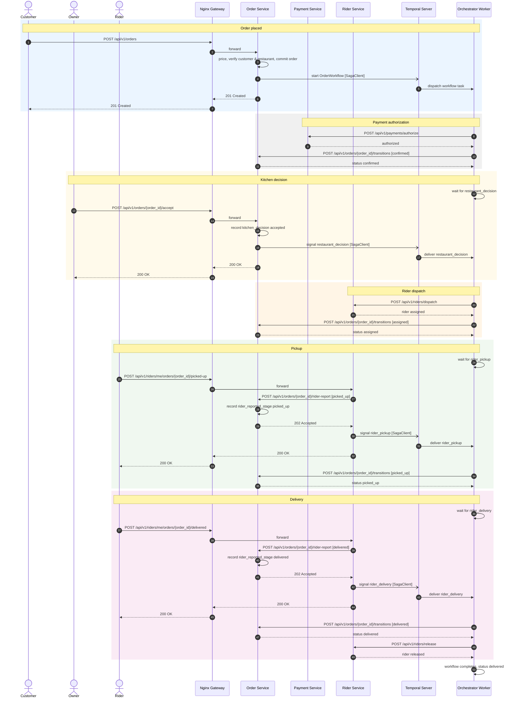

# SmartFoodOps — Order Lifecycle Sequence Diagram (Creation to Completion)

Happy path only, `created` through `delivered`, verified against
`services/order/apis/checkout.py`, `services/orchestrator/workflows/order.py`,
`services/orchestrator/activities/order.py`, `services/order/apis/kitchen.py`,
`services/order/apis/rider_reports.py`, `services/order/apis/transitions.py`, and
`services/rider/apis/delivery.py`. See
[readme/order-saga-orchestration-guide.md](../order-saga-orchestration-guide.md) for the
full reasoning behind each step, and
[order_sequence_diagram.md](order_sequence_diagram.md) for order creation's own edge cases.

