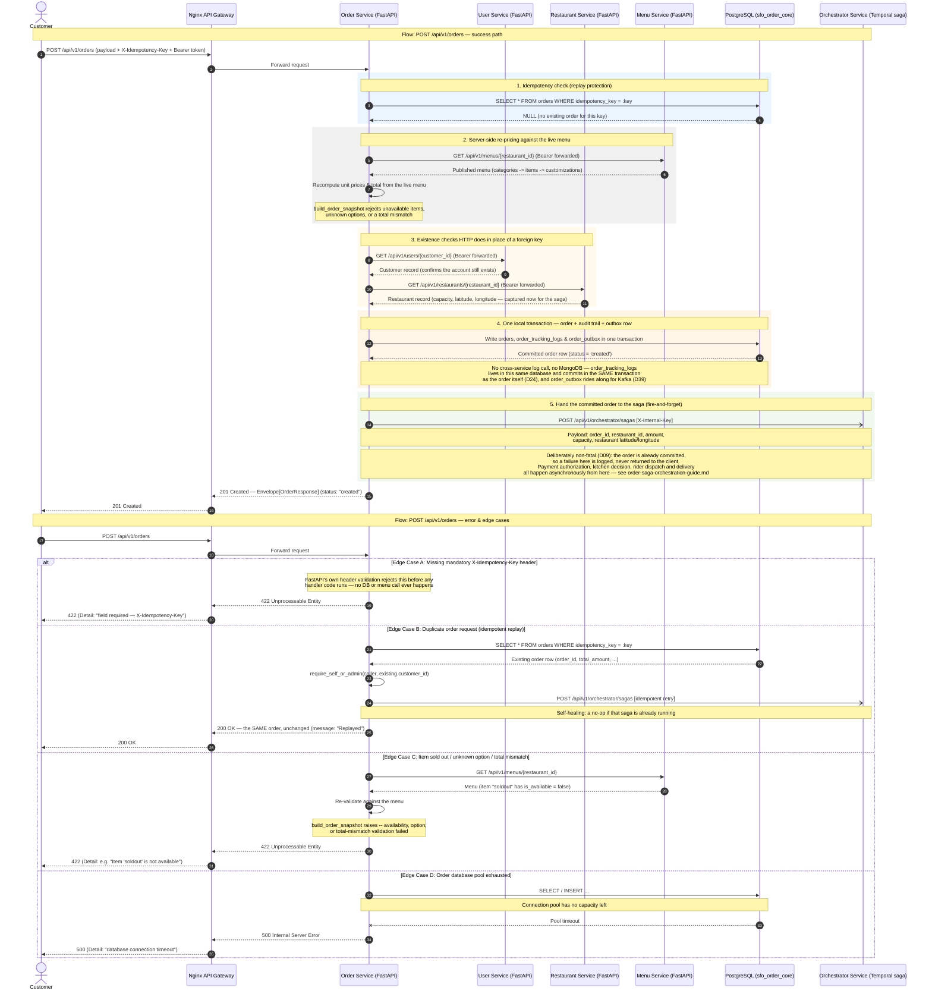

# SmartFoodOps — Order Creation Sequence Diagram

`POST /api/v1/orders`, success path and edge cases, verified against
[services/order/apis/checkout.py](../../services/order/apis/checkout.py), its HTTP clients in
`services/order/clients/`, and `services/order/repositories/orders.py` as of Week 3 — see
[readme/key-decisions.md](../key-decisions.md) for the D-numbers cited inline below.

This diagram stops at the hand-off to the saga on purpose — everything from payment
authorization onward is a separate asynchronous flow; see
[readme/order-saga-orchestration-guide.md](../order-saga-orchestration-guide.md) for that half.

