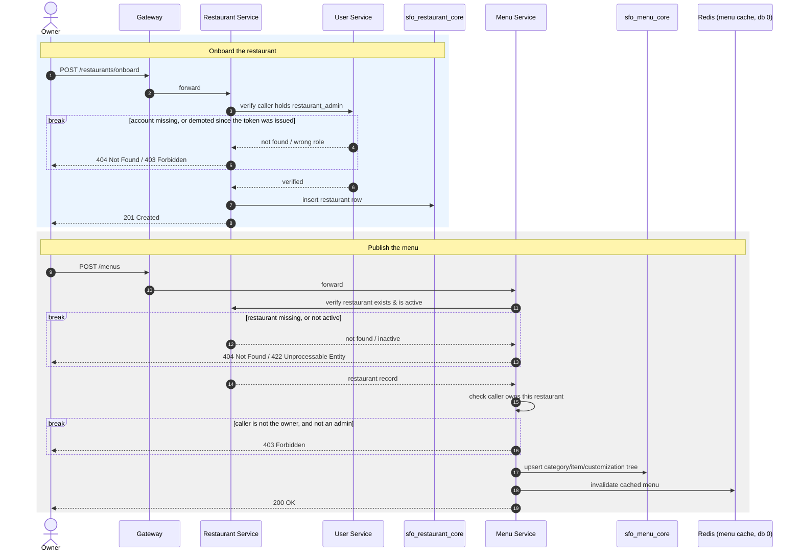

# SmartFoodOps — Restaurant Onboarding Sequence Diagram

Onboarding a restaurant and publishing its menu — the one diagram for getting a restaurant
ready to receive orders. Verified against `services/restaurant/apis/restaurants.py` and
`services/menu/apis/menus.py`. Assumes the owner already has an account — see
[user_registration_sequence_diagram.md](user_registration_sequence_diagram.md).

