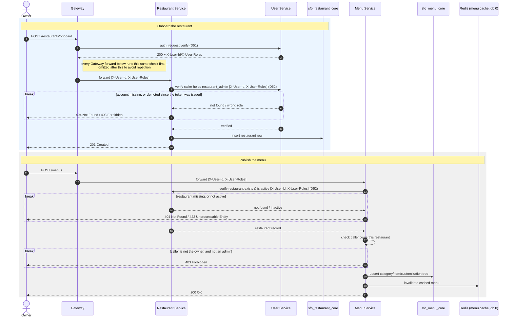

# SmartFoodOps — Restaurant Onboarding Sequence Diagram

Onboarding a restaurant and publishing its menu — the one diagram for getting a restaurant
ready to receive orders. Verified against `services/restaurant/apis/restaurants.py` and
`services/menu/apis/menus.py`. Assumes the owner already has an account — see
[user_registration_sequence_diagram.md](user_registration_sequence_diagram.md).

The gateway verifies the bearer token once, via `auth_request` against the User Service
(D51), before forwarding either request below; the identity it establishes travels as
`X-User-Id`/`X-User-Roles`, which `RestaurantSvc`/`MenuSvc` then assert back to the User
Service or each other instead of forwarding a bearer token (D52).

```mermaid
sequenceDiagram
    autonumber
    actor Owner
    participant Gateway
    participant RestaurantSvc as Restaurant Service
    participant UserSvc as User Service
    participant RestaurantDB as sfo_restaurant_core
    participant MenuSvc as Menu Service
    participant MenuDB as sfo_menu_core
    participant Redis as Redis (menu cache, db 0)

    rect rgb(235, 245, 255)
        Note over Owner, RestaurantDB: Onboard the restaurant
        Owner->>Gateway: POST /restaurants/onboard
        Gateway->>UserSvc: auth_request verify (D51)
        UserSvc-->>Gateway: 200 + X-User-Id/X-User-Roles
        Note right of Gateway: every Gateway forward below runs this same check first --<br/>omitted after this to avoid repetition
        Gateway->>RestaurantSvc: forward [X-User-Id, X-User-Roles]
        RestaurantSvc->>UserSvc: verify caller holds restaurant_admin [X-User-Id, X-User-Roles] (D52)
        break account missing, or demoted since the token was issued
            UserSvc-->>RestaurantSvc: not found / wrong role
            RestaurantSvc-->>Owner: 404 Not Found / 403 Forbidden
        end
        UserSvc-->>RestaurantSvc: verified
        RestaurantSvc->>RestaurantDB: insert restaurant row
        RestaurantSvc-->>Owner: 201 Created
    end

    rect rgb(240, 240, 240)
        Note over Owner, Redis: Publish the menu
        Owner->>Gateway: POST /menus
        Gateway->>MenuSvc: forward [X-User-Id, X-User-Roles]
        MenuSvc->>RestaurantSvc: verify restaurant exists & is active [X-User-Id, X-User-Roles] (D52)
        break restaurant missing, or not active
            RestaurantSvc-->>MenuSvc: not found / inactive
            MenuSvc-->>Owner: 404 Not Found / 422 Unprocessable Entity
        end
        RestaurantSvc-->>MenuSvc: restaurant record
        MenuSvc->>MenuSvc: check caller owns this restaurant
        break caller is not the owner, and not an admin
            MenuSvc-->>Owner: 403 Forbidden
        end
        MenuSvc->>MenuDB: upsert category/item/customization tree
        MenuSvc->>Redis: invalidate cached menu
        MenuSvc-->>Owner: 200 OK
    end
```
