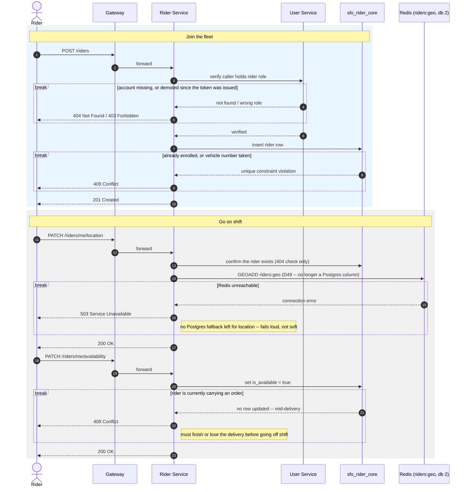

# SmartFoodOps — Rider Onboarding Sequence Diagram

Joining the delivery fleet and going on shift — the one diagram for a rider becoming
dispatchable. Verified against `services/rider/apis/profile.py`. Assumes the rider already
has an account — see
[user_registration_sequence_diagram.md](user_registration_sequence_diagram.md). Once
available and located, [order_flow_sequence_diagram.md](order_flow_sequence_diagram.md)
covers dispatch, pickup and delivery.

