# SmartFoodOps — Complete System Architecture

Every container in `docker-compose.yml` as of Week 3, with real host/container ports and
the actual dependency graph — not an idealized version. See
[readme/key-decisions.md](../key-decisions.md) for the D-numbers behind the shape (D01
database-per-service, D25 orchestration over choreography, D36 the orchestrator split,
D38 Kafka carries facts / Temporal owns decisions, D39 the transactional outbox).

```mermaid
flowchart TB
    Client["Customer / Owner / Rider client"]

    Gateway["Nginx API Gateway<br/>host 80"]

    subgraph AppServices ["Application Services"]
        UserSvc["User Service<br/>8001"]
        RestaurantSvc["Restaurant Service<br/>8002"]
        MenuSvc["Menu Service<br/>8003"]
        OrderSvc["Order Service<br/>8004"]
        PaymentSvc["Payment Service<br/>8005"]
        RiderSvc["Rider Service<br/>8006"]
        OrchestratorAPI["Orchestrator Service<br/>8007"]
        AnalyticsSvc["Analytics Service<br/>8008"]
    end

    subgraph Saga ["Orchestration (Temporal)"]
        OrchestratorWorker["Orchestrator Worker<br/>metrics 9108"]
        TemporalServer["Temporal Server<br/>7233 / 8233 / 9233"]
        TemporalDB["Temporal Postgres"]
    end

    subgraph Eventing ["Eventing"]
        Kafka["Kafka<br/>9092"]
        SchemaRegistry["Schema Registry<br/>8081"]
    end

    subgraph Notify ["Notifications"]
        NotifConsumer["Notification Consumer<br/>metrics 9110"]
        NotifWorker["Notification Worker (Celery)"]
        RabbitMQ["RabbitMQ<br/>5672 / 15672 / 15692"]
    end

    subgraph Data ["Databases and Cache"]
        UserDB["sfo_user_core<br/>5432"]
        RestaurantDB["sfo_restaurant_core<br/>5433"]
        OrderDB["sfo_order_core<br/>5434"]
        PaymentDB["sfo_payment_core<br/>5435"]
        MenuDB["sfo_menu_core<br/>5436"]
        RiderDB["sfo_rider_core<br/>5437"]
        AnalyticsDB["sfo_analytics_core<br/>5438"]
        Redis["Redis<br/>6379"]
    end

    subgraph Observability ["Observability"]
        Jaeger["Jaeger<br/>16686"]
        Prometheus["Prometheus<br/>9090"]
        Grafana["Grafana<br/>3000"]
    end

    Client --> Gateway
    Gateway --> UserSvc
    Gateway --> RestaurantSvc
    Gateway --> MenuSvc
    Gateway --> OrderSvc
    Gateway --> PaymentSvc
    Gateway --> RiderSvc
    Gateway -->|health only| OrchestratorAPI

    OrderSvc -->|verify customer| UserSvc
    OrderSvc -->|verify restaurant| RestaurantSvc
    OrderSvc -->|fetch menu| MenuSvc
    OrderSvc -->|start and signal saga| OrchestratorAPI
    PaymentSvc -->|verify order total| OrderSvc
    RiderSvc -->|relay pickup and delivery| OrderSvc

    OrchestratorAPI -->|start and signal workflow| TemporalServer
    OrchestratorWorker -->|poll order_tasks queue| TemporalServer
    OrchestratorWorker -->|authorize and refund| PaymentSvc
    OrchestratorWorker -->|transitions and internal reads| OrderSvc
    OrchestratorWorker -->|dispatch and release| RiderSvc
    TemporalServer --> TemporalDB

    UserSvc --> UserDB
    RestaurantSvc --> RestaurantDB
    MenuSvc --> MenuDB
    OrderSvc --> OrderDB
    PaymentSvc --> PaymentDB
    RiderSvc --> RiderDB
    AnalyticsSvc --> AnalyticsDB
    MenuSvc -->|menu cache| Redis
    UserSvc -->|refresh tokens| Redis

    OrderSvc -->|outbox relay| Kafka
    PaymentSvc -->|outbox relay| Kafka
    AnalyticsSvc -->|consume| Kafka
    NotifConsumer -->|consume| Kafka
    OrderSvc -.->|register and validate schema| SchemaRegistry
    PaymentSvc -.->|register and validate schema| SchemaRegistry
    AnalyticsSvc -.->|validate schema| SchemaRegistry
    NotifConsumer -.->|validate schema| SchemaRegistry

    NotifConsumer -->|enqueue task| RabbitMQ
    RabbitMQ --> NotifWorker
    NotifWorker -->|resolve contact| UserSvc

    AppServices -.->|traces| Jaeger
    OrchestratorWorker -.->|traces| Jaeger
    AppServices -.->|metrics| Prometheus
    OrchestratorWorker -.->|metrics| Prometheus
    TemporalServer -.->|metrics| Prometheus
    RabbitMQ -.->|metrics| Prometheus
    Grafana -->|query| Prometheus
```

