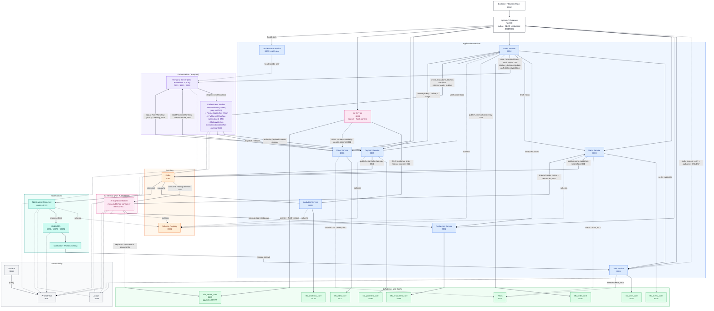

# SmartFoodOps — Complete System Architecture

Every container in `docker-compose.yml`, with real host/container ports and the actual
dependency graph — not an idealized version. See
[readme/key-decisions.md](../key-decisions.md) for the D-numbers behind the shape (D01
database-per-service, D25/D54 orchestration over choreography — order creation itself
happens inside the saga, started by the API and awaited for its result, D58, D36 the orchestrator split, D38 Kafka
carries facts / Temporal owns decisions, D47 services hold their own Temporal client, D51
the gateway's `auth_request` chokepoint, D52 internal calls asserting identity headers
instead of forwarding the bearer token, D53 the transactional outbox tables are removed in
favour of a Temporal-activity publish, D55 payment/rider/compensation become child
workflows, D57 RBAC moves into the database and is enforced at the gateway, D58 checkout
starts `OrderWorkflow` and answers after payment, with the post-payment work in an abandoned
`FulfillmentWorkflow`, and — for Part B — D59 the AI Service with its own pgvector database, D60
owner-declared menu tags, D61 `menu.published` feeding an ingestion worker, D62 the RAG context
assembler).

The AI layer (pink) is two containers from one image: `ai-service` answers search and RAG-context
requests (gated at the gateway like every other route, `ai:search` / `ai:rag_context`), and
`ai-ingestion-worker` consumes `menu.published`, re-reads the menu and restaurant over internal-key
routes, and keeps `sfo_vector_core` in step. RAG context also reads the Analytics and Rider services,
and degrades — naming the failed source — rather than failing when one is down.

Every `Gateway -->` edge below implies a preceding `auth_request` round trip to the User
Service's internal verify endpoint (D51) — drawn once, explicitly, as the dotted edge into
`UserSvc`, rather than repeated on each application-service edge. That round trip decides
two things, not one (D57): whether the token is valid, and whether the caller's roles carry
the permission the requested route demands, read from `route_permissions`/`role_permissions`
in `sfo_user_core`. So a `403` is as likely to come from that dotted edge as a `401`, and a
wrong-role request never reaches the service it was aimed at. A successful verify sets
`X-User-Id`/`X-User-Roles`/`X-User-Permissions`, which the gateway attaches to the forwarded
request and which every `-->|verify ...|` edge between application services below now carries
in place of a forwarded bearer token (D52) — login, register, refresh and every `/health`
route are the exceptions, reachable with no token at all.

Nodes are color-coded by subsystem (application services, the Temporal saga,
Kafka/schema-registry eventing, the notification bridge, databases, observability) so a
line's color/region tells you what it belongs to even where paths cross.

```mermaid
%%{init: {"flowchart": {"curve": "linear", "nodeSpacing": 35, "rankSpacing": 55, "htmlLabels": true}}}%%
flowchart TB
    Client["Customer / Owner / Rider client"]
    Gateway["Nginx API Gateway<br/>host 80<br/>authn + RBAC chokepoint (D51/D57)"]

    subgraph AppServices ["Application Services"]
        UserSvc["User Service<br/>8001"]
        RestaurantSvc["Restaurant Service<br/>8002"]
        MenuSvc["Menu Service<br/>8003"]
        OrderSvc["Order Service<br/>8004"]
        PaymentSvc["Payment Service<br/>8005"]
        RiderSvc["Rider Service<br/>8006"]
        OrchestratorAPI["Orchestrator Service<br/>8007 health only"]
        AnalyticsSvc["Analytics Service<br/>8008"]
        AISvc["AI Service<br/>8009<br/>search + RAG context"]
    end

    subgraph AI ["AI retrieval (Part B, D59-D62)"]
        AIWorker["AI Ingestion Worker<br/>menu.published consumer<br/>metrics 9111"]
    end

    subgraph Saga ["Orchestration (Temporal)"]
        TemporalServer["Temporal Server (dev, embedded SQLite)<br/>7233 / 8233 / 9233"]
        OrchestratorWorker["Orchestrator Worker<br/>OrderWorkflow (create, pay, confirm)<br/>-> PaymentWorkflow (child)<br/>-> FulfillmentWorkflow (abandoned, D58)<br/>-> RiderWorkflow, CompensationWorkflow<br/>metrics 9108"]
    end

    subgraph Eventing ["Eventing"]
        Kafka["Kafka<br/>9092"]
        SchemaRegistry["Schema Registry<br/>8081"]
    end

    subgraph Notify ["Notifications"]
        NotifConsumer["Notification Consumer<br/>metrics 9110"]
        RabbitMQ["RabbitMQ<br/>5672 / 15672 / 15692"]
        NotifWorker["Notification Worker (Celery)"]
    end

    subgraph Data ["Databases and Cache"]
        UserDB["sfo_user_core<br/>5432"]
        RestaurantDB["sfo_restaurant_core<br/>5433"]
        OrderDB["sfo_order_core<br/>5434"]
        PaymentDB["sfo_payment_core<br/>5435"]
        MenuDB["sfo_menu_core<br/>5436"]
        RiderDB["sfo_rider_core<br/>5437"]
        AnalyticsDB["sfo_analytics_core<br/>5438"]
        VectorDB["sfo_vector_core<br/>5439<br/>pgvector, HNSW"]
        Redis["Redis<br/>6379"]
    end

    subgraph Observability ["Observability"]
        Jaeger["Jaeger<br/>16686"]
        Prometheus["Prometheus<br/>9090"]
        Grafana["Grafana<br/>3000"]
    end

    %% -- request entry --
    Client --> Gateway
    Gateway -.->|auth_request verify + authorize, D51/D57| UserSvc
    Gateway --> UserSvc & RestaurantSvc & MenuSvc & OrderSvc & PaymentSvc & RiderSvc & AISvc
    Gateway -->|health only| OrchestratorAPI

    %% -- synchronous service-to-service calls: identity headers, not a forwarded token (D52) --
    OrderSvc -->|verify customer| UserSvc
    OrderSvc -->|verify restaurant| RestaurantSvc
    OrderSvc -->|fetch menu| MenuSvc
    PaymentSvc -->|verify order total| OrderSvc
    RiderSvc -->|record pickup / delivery stage| OrderSvc

    %% -- saga: services hold their own Temporal client (D47) --
    OrderSvc -->|start OrderWorkflow + await result, D58<br/>kitchen_decision Update on FulfillmentWorkflow| TemporalServer
    PaymentSvc -->|start PaymentWorkflow, manual mode, D55| TemporalServer
    RiderSvc -->|signal RiderWorkflow: pickup / delivery, D55| TemporalServer
    OrchestratorAPI -.->|health probe only| TemporalServer
    TemporalServer -->|dispatch workflow task| OrchestratorWorker
    OrchestratorWorker -->|authorize / refund / create manual| PaymentSvc
    OrchestratorWorker -->|create, transitions, kitchen decision,<br/>internal reads, publish| OrderSvc
    OrchestratorWorker -->|dispatch / release| RiderSvc

    %% -- Part B: the AI layer. All reads of other services' data go over internal-key routes
    %% (D01), never their databases; the vectors are derived state in the AI Service's own --
    AIWorker -->|internal reads: menu + restaurant, D61| MenuSvc
    AIWorker -->|internal read: restaurant| RestaurantSvc
    AISvc -->|RAG: customer order history, internal, D62| AnalyticsSvc
    AISvc -->|RAG: courier availability counts, internal, D62| RiderSvc

    %% -- each service owns one database --
    UserSvc --> UserDB
    RestaurantSvc --> RestaurantDB
    MenuSvc --> MenuDB
    OrderSvc --> OrderDB
    PaymentSvc --> PaymentDB
    RiderSvc --> RiderDB
    AnalyticsSvc --> AnalyticsDB
    AISvc -->|search + RAG vectors| VectorDB
    AIWorker -->|replace a restaurant's documents| VectorDB
    MenuSvc -.->|menu cache, db 0| Redis
    UserSvc -.->|refresh tokens, db 1| Redis
    %% D49: rider live location moved from a Postgres column to this Redis GEO index.
    RiderSvc -.->|location GEO index, db 2| Redis

    %% -- eventing: D53 replaced the outbox relay with a KafkaGateway each service holds,
    %% called synchronously from an internal endpoint a Temporal activity invokes --
    OrderSvc -->|publish, via KafkaGateway, D53| Kafka
    PaymentSvc -->|publish, via KafkaGateway, D53| Kafka
    MenuSvc -->|publish menu.published, best-effort, D61| Kafka
    Kafka -->|consume menu.published, D61| AIWorker
    Kafka -->|consume| AnalyticsSvc
    Kafka -->|consume| NotifConsumer
    OrderSvc -.->|schema| SchemaRegistry
    PaymentSvc -.->|schema| SchemaRegistry
    AnalyticsSvc -.->|schema| SchemaRegistry
    MenuSvc -.->|schema| SchemaRegistry
    AIWorker -.->|schema| SchemaRegistry
    NotifConsumer -.->|schema| SchemaRegistry

    %% -- notifications: Kafka to Celery bridge --
    NotifConsumer -->|enqueue task| RabbitMQ
    RabbitMQ --> NotifWorker
    NotifWorker -->|resolve contact| UserSvc

    %% -- observability: every service traces + exposes /metrics (target node implies which) --
    AppServices -.-> Jaeger
    OrchestratorWorker -.-> Jaeger
    NotifConsumer -.-> Jaeger
    AIWorker -.-> Jaeger
    AppServices -.-> Prometheus
    OrchestratorWorker -.-> Prometheus
    NotifConsumer -.-> Prometheus
    AIWorker -.-> Prometheus
    TemporalServer -.-> Prometheus
    RabbitMQ -.-> Prometheus
    Grafana -->|query| Prometheus

    classDef app fill:#dbeafe,stroke:#2563eb,color:#1e3a8a;
    classDef saga fill:#ede9fe,stroke:#7c3aed,color:#4c1d95;
    classDef evt fill:#ffedd5,stroke:#ea580c,color:#7c2d12;
    classDef notify fill:#ccfbf1,stroke:#0d9488,color:#134e4a;
    classDef data fill:#dcfce7,stroke:#16a34a,color:#14532d;
    classDef obs fill:#f3f4f6,stroke:#6b7280,color:#1f2937;
    classDef ai fill:#fce7f3,stroke:#db2777,color:#831843;
    classDef edge fill:#fff,stroke:#111827,color:#111827;

    class UserSvc,RestaurantSvc,MenuSvc,OrderSvc,PaymentSvc,RiderSvc,OrchestratorAPI,AnalyticsSvc app;
    class AISvc,AIWorker ai;
    class TemporalServer,OrchestratorWorker saga;
    class Kafka,SchemaRegistry evt;
    class NotifConsumer,RabbitMQ,NotifWorker notify;
    class UserDB,RestaurantDB,OrderDB,PaymentDB,MenuDB,RiderDB,AnalyticsDB,VectorDB,Redis data;
    class Jaeger,Prometheus,Grafana obs;
    class Client,Gateway edge;

    linkStyle default stroke:#111827,stroke-width:1.2px;

    style AppServices fill:#eff6ff,stroke:#2563eb,stroke-width:1px;
    style Saga fill:#f5f3ff,stroke:#7c3aed,stroke-width:1px;
    style Eventing fill:#fff7ed,stroke:#ea580c,stroke-width:1px;
    style Notify fill:#f0fdfa,stroke:#0d9488,stroke-width:1px;
    style AI fill:#fdf2f8,stroke:#db2777,stroke-width:1px;
    style Data fill:#f0fdf4,stroke:#16a34a,stroke-width:1px;
    style Observability fill:#f9fafb,stroke:#6b7280,stroke-width:1px;
```
