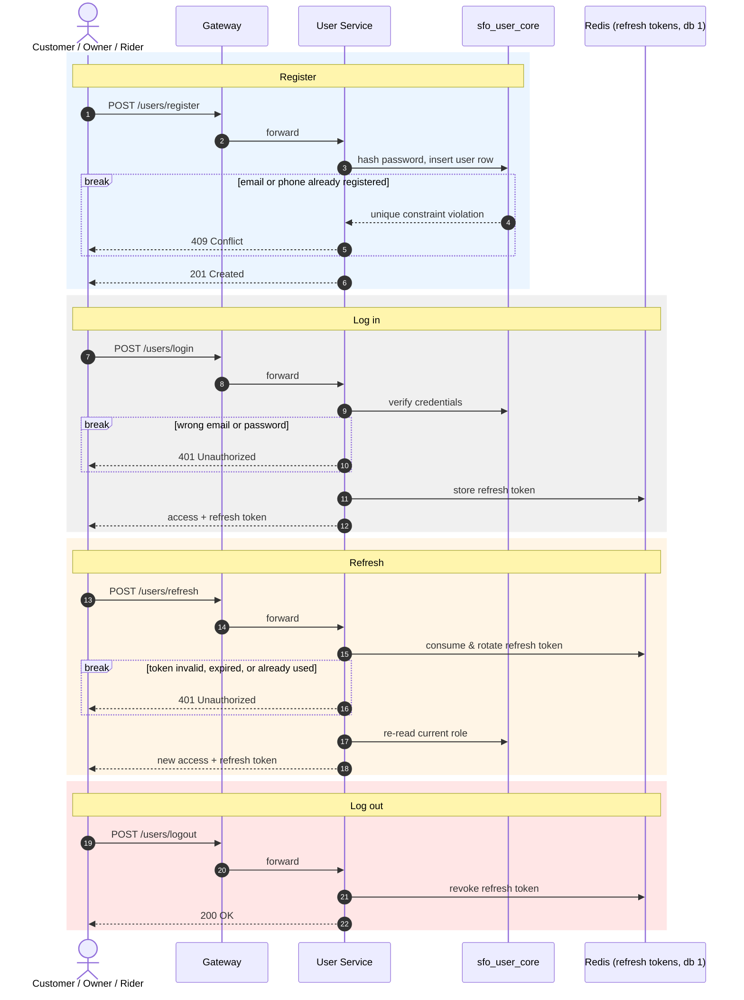

# SmartFoodOps — User Registration & Session Sequence Diagram

Register, log in, refresh, and log out — the one diagram for identity, common to every
role (`customer`, `restaurant_admin`, `rider`, `system_admin`). Verified against
`services/user/apis/users.py` and `services/user/apis/sessions.py`.

