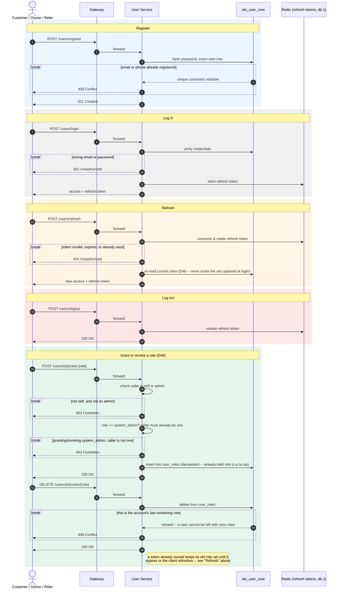

# SmartFoodOps — User Registration & Session Sequence Diagram

Register, log in, refresh, log out, and manage additional role grants — the one diagram
for identity, common to every role (`customer`, `restaurant_admin`, `rider`,
`system_admin`). A user can hold more than one role at once since D48 — registration
grants exactly one, and everything after that goes through the grant/revoke routes below.
Verified against `services/user/apis/users.py`, `services/user/apis/sessions.py`, and
`services/user/apis/roles.py`.

