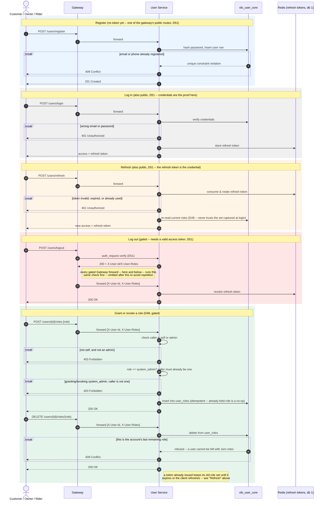

# SmartFoodOps — User Registration & Session Sequence Diagram

Register, log in, refresh, log out, and manage additional role grants — the one diagram
for identity, common to every role (`customer`, `restaurant_admin`, `rider`,
`system_admin`). A user can hold more than one role at once since D48 — registration
grants exactly one, and everything after that goes through the grant/revoke routes below.
Verified against `services/user/apis/users.py`, `services/user/apis/sessions.py`, and
`services/user/apis/roles.py`.

Register, log in and refresh are the three routes the gateway never gates (D51): there is
no token yet to verify, or — for refresh — the refresh token itself is the credential.
Logout and the role routes below *do* require a valid access token, so the gateway runs its
`auth_request` verify against the User Service first, exactly as it would for any other
service — shown explicitly once, on logout, since here the verify and the forwarded call
happen to land on the same service.

```mermaid
sequenceDiagram
    autonumber
    actor Client as Customer / Owner / Rider
    participant Gateway
    participant UserSvc as User Service
    participant UserDB as sfo_user_core
    participant Redis as Redis (refresh tokens, db 1)

    rect rgb(235, 245, 255)
        Note over Client, UserDB: Register (no token yet -- one of the gateway's public routes, D51)
        Client->>Gateway: POST /users/register
        Gateway->>UserSvc: forward
        UserSvc->>UserDB: hash password, insert user row
        break email or phone already registered
            UserDB-->>UserSvc: unique constraint violation
            UserSvc-->>Client: 409 Conflict
        end
        UserSvc-->>Client: 201 Created
    end

    rect rgb(240, 240, 240)
        Note over Client, Redis: Log in (also public, D51 -- credentials are the proof here)
        Client->>Gateway: POST /users/login
        Gateway->>UserSvc: forward
        UserSvc->>UserDB: verify credentials
        break wrong email or password
            UserSvc-->>Client: 401 Unauthorized
        end
        UserSvc->>Redis: store refresh token
        UserSvc-->>Client: access + refresh token
    end

    rect rgb(255, 245, 230)
        Note over Client, Redis: Refresh (also public, D51 -- the refresh token is the credential)
        Client->>Gateway: POST /users/refresh
        Gateway->>UserSvc: forward
        UserSvc->>Redis: consume & rotate refresh token
        break token invalid, expired, or already used
            UserSvc-->>Client: 401 Unauthorized
        end
        UserSvc->>UserDB: re-read current roles (D48 -- never trusts the set captured at login)
        UserSvc-->>Client: new access + refresh token
    end

    rect rgb(255, 230, 230)
        Note over Client, Redis: Log out (gated -- needs a valid access token, D51)
        Client->>Gateway: POST /users/logout
        Gateway->>UserSvc: auth_request verify (D51)
        UserSvc-->>Gateway: 200 + X-User-Id/X-User-Roles
        Note right of Gateway: every gated Gateway forward -- here and below -- runs this<br/>same check first -- omitted after this to avoid repetition
        Gateway->>UserSvc: forward [X-User-Id, X-User-Roles]
        UserSvc->>Redis: revoke refresh token
        UserSvc-->>Client: 200 OK
    end

    rect rgb(230, 245, 235)
        Note over Client, UserDB: Grant or revoke a role (D48, gated)
        Client->>Gateway: POST /users/{id}/roles [role]
        Gateway->>UserSvc: forward [X-User-Id, X-User-Roles]
        UserSvc->>UserSvc: check caller is self or admin
        break not self, and not an admin
            UserSvc-->>Client: 403 Forbidden
        end
        UserSvc->>UserSvc: role == system_admin? caller must already be one
        break granting/revoking system_admin, caller is not one
            UserSvc-->>Client: 403 Forbidden
        end
        UserSvc->>UserDB: insert into user_roles (idempotent -- already-held role is a no-op)
        UserSvc-->>Client: 200 OK
        Client->>Gateway: DELETE /users/{id}/roles/{role}
        Gateway->>UserSvc: forward [X-User-Id, X-User-Roles]
        UserSvc->>UserDB: delete from user_roles
        break this is the account's last remaining role
            UserDB-->>UserSvc: refused -- a user cannot be left with zero roles
            UserSvc-->>Client: 409 Conflict
        end
        UserSvc-->>Client: 200 OK
        Note right of UserSvc: a token already issued keeps its old role set until it<br/>expires or the client refreshes -- see "Refresh" above
    end
```
